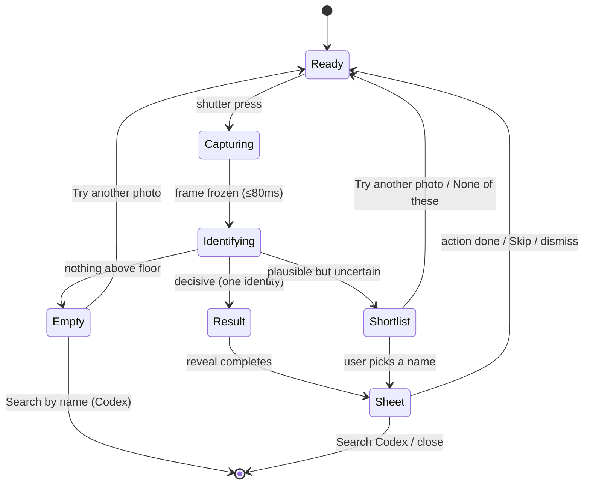

# Card Recogniser Rev 6 - Snapshot interaction design

**Scope:** interaction, visual, and accessibility design for the pure-snapshot scanner. The ML/technical
architecture (DINOv2 matcher, OCR refiner, thresholds calibration) is a separate proposal; this document
consumes its outputs as a ranked shortlist + scores. The post-confirm result sheet (`RecognitionCard`)
is reused **unchanged** - this flow ends by handing it a confirmed card.

**Design system:** Manuscript, `[Shipping]` vocabulary only (`DESIGN_SYSTEM.md`). Native Compose scanner
surface (`scanner/ui/`), same palette, type, and Gilt Impression material language already device-verified
in build 206.

**Codex disposition (recorded) - MVP changes to this design:**
- **650ms reveal: APPROVED** (one shared clock; owner may restore 800ms after device feel-testing).
- **Shutter-as-progress-ring: APPROVED.**
- **Match captions ("Matched by art…"): REMOVED from MVP** - they overstate what OCR actually knows and
  would modify the otherwise-untouched `RecognitionCard`. The frozen photo + card name are sufficient. S2.4
  / S2.5 captions do not ship; `RecognitionCard` stays unchanged.
- **First-run three-appearance hint: REMOVED** (no persisted per-profile state). Replaced by ONE permanent
  Ready line: *Fill the frame with one card, portrait or landscape, then tap.* This also supersedes the S2.1
  / S4 status copy and narrows the promise from "any way up" to **portrait or landscape** (rotation unproven).
- **Card name over the full-bleed stamp (S2.4): geometry corrected** - a 12dp-inset frame has no meaningful
  "above". The existing sheet owns the accessible card title; do not paint an overlapping name band over the
  frozen still. (The Gilt Impression stamp on the still stays; the name lives in the sheet.)
- **State model: no persistent `Result`** - a confident match populates `RecognitionCard` and triggers its
  reveal directly. States are Ready / Capturing / Identifying / Shortlist / Empty.

---

## 1 · The interaction model

Every scan is one deliberate act: the user frames a card - any orientation, portrait spell or sideways
site - and presses the **gilt shutter** once. The frame freezes instantly (the user's own photo is the
subject for the rest of the flow), the device reads it for under a second, and then exactly one of three
things happens: a **confident single identity** stamps onto the frozen still with the Gilt Impression and
the existing action sheet rises; a **short pick-list** of up to five names asks the user to choose; or an
honest **empty state** offers another photo or a name search. Nothing is ever written without a user tap:
the sheet's actions are the confirm in the single-answer case, and a pick is the confirm in the list case.
Dismissing any outcome returns to a live, re-armed viewfinder.

State names for implementation: `SnapState.Ready / Capturing / Identifying / Result / Shortlist / Empty`
(replacing the live-loop `Phase.SEARCHING / DETECTING` machine). QR detection (shared decks/matches,
Share & Scan) continues to run passively on the live feed in Ready and is unaffected by this redesign.

---

## 2 · The states

### 2.1 Ready - the open viewfinder

**On screen.** Full-bleed live camera preview. No guide frame, no corner guides, no surround dim - the
viewfinder is the card table. Three pieces of chrome only:

- **Close** - the existing gold X in a round 48dp button, top-right (unchanged).
- **Status line** - one parchment line, top-centre, offset below the close row (existing `StatusText`
  position, `FontUi` 14.5sp, parchment `#EFE7D8`, the existing text shadow so it reads over any feed):
  > *Fill the frame with a card, then tap the shutter*
  A subtle top scrim (black 0 → 35% over the top ~120dp) keeps this legible on bright feeds; no full-frame
  vignette.
- **The gilt shutter** - bottom-centre, above the navigation bar inset.

**The shutter (capture affordance).** A dedicated button, not full-screen tap:

- Full-screen tap collides with three existing gestures (tap-outside-dismisses-sheet, future tap-to-focus,
  and accidental palm touches while lining up a card), makes accidental captures routine in the rapid-add
  loop, and gives TalkBack nothing to focus. A shutter is the universal camera affordance - "every scan is
  deliberate" is the whole point of Rev 6, and a deliberate act deserves a physical-feeling trigger.
- **Form - "the seal":** a 72dp round button (well over the 48dp floor) drawn in the app's language: an
  outer 2.25dp gold ring (`PillarGold`), a 1dp inner ring at 6dp inset (the Gilt Impression double-rule,
  bent into a circle), ink-dark fill (`#17130B` at 55% over the feed), and a plain parchment centre dot
  (14dp) as the trigger mark. No glyph, no label - it reads as a wax seal awaiting its press.
- **Press state:** the centre dot brightens to full parchment and the outer ring thickens to 3.25dp for
  the press duration (the existing "firm contact via brightness + stroke weight, no scaling" rule).
- In deck and collection modes the centre dot takes the mode accent (violet / ruby) so the mode is legible
  at a glance; the rings stay gold (chrome is gold, the accent is a functional dot - the §2 one-dot rule).

**Motion.** None. Ready is still - the existing "no idle animation" stance.

**Haptics.** None in Ready.

### 2.2 Capturing - the press

A single beat, target ≤80ms perceived:

1. Shutter press → `ScannerHaptics.tick()` fires immediately (the light 14ms engagement tick - repurposed
   from "engaged a candidate" to "the press landed").
2. The live feed **freezes to the captured still** in place - no flash-to-black, no iris animation. The
   freeze itself is the shutter feedback: the world stops.
3. The shutter's centre dot swaps to the violet reading state (below) with no gap.

There is no separate visual state to dwell in; Capturing exists in the state machine so the shutter can
disarm instantly (double-taps during the freeze are ignored, not queued).

### 2.3 Identifying - the sub-second read

Design intent: ~0.7-1.0s must feel like *the device studying the user's photo*, not a spinner over a
stalled app. Three coordinated signals, all quiet:

- **The frozen still stays full-bleed** and dims to 78% (a 22% black wash, 120ms ease-in). The user's own
  photo remains the subject - they can see exactly what the device is reading.
- **The shutter becomes the reader.** The parchment centre dot extinguishes and the outer gold ring hands
  over to a **violet arc** (`PillarViolet`, 2.25dp) sweeping the same 72dp circle - an indeterminate ring,
  one revolution ≈900ms, so a typical read completes within roughly one sweep. Violet is already the
  scanner's "engaged and reading" colour (the old recognising frame); it now lives in the shutter instead
  of a frame.
- **Status line** swaps (crossfade 120ms) to:
  > *Reading the card…*

No frame, no scan-line sweep across the photo, no pulsing overlay on the card - nothing is ever drawn over
the artwork (existing law).

**Haptics.** None during the read (the press tick already acknowledged the input; a second buzz before the
outcome would blur the culminate).

**If the read runs long** (>1.6s, a defensive bound only): the status line appends nothing and no second
animation starts - the arc just keeps sweeping. The read is bounded by the engine; there is no cancel
affordance because there is nothing worth cancelling at this duration. Android Back during Identifying
discards the read and returns to Ready.

### 2.4 Result - one confident identity

Entered per the §3 rule. The Gilt Impression plays, retargeted from the old guide rect to **the frozen
still itself**:

- The violet arc extinguishes; the gilt double-rule (2.25dp outer / 1dp inner), ink deboss, halo flare,
  sheen, and four corner bosses stamp **around the full frozen photo**, inset 12dp from the screen edges -
  the snapshot becomes the manuscript plate. Same layer recipe, same easings, same "brightness + stroke
  weight, never scale" law as `CameraOverlay` ships today.
- The **card name translates up 14dp and fades in** above the frame in Cinzel gold, over the centre-fade
  gilt hairline - unchanged from the shipping reveal.
- The **existing `RecognitionCard` sheet** rides the same shared clock and arrives late, exactly as today.
  Its eyebrow, actions, printing picker, deck-limit logic, and mode behaviours are untouched.

**Timing.** The shared reveal clock shortens from 800ms to **650ms** for snapshot (stamp contact by
~100ms, halo peak ~190ms, name settled ~340ms, tray fully in by ~560ms). Rationale: the live scanner's
reveal also had to *announce* that recognition had happened; in snapshot the capture beat already did
that, and the rapid-add loop pays for every spare frame. (Owner may keep 800ms if the 650ms feel is thin
on device - the clock is one constant.)

**How OCR confirmation is surfaced.** Quietly, inside the sheet: when the identity was text-confirmed
(§3), a one-line caption sits under the sheet title in muted ink (`FontUi` 12sp, onSurface at 60%):

> *Matched by art and printed name*

When the identity is visual-only (decisive image match, typical for sites):

> *Matched by art*

This is information, not celebration - no badge, no second accent. It also gives the user a truthful basis
for trusting (or double-checking) the match.

**Haptics.** `ScannerHaptics.culminate()` fires so its 255-amplitude finish lands on the halo peak
(~190ms into the reveal) - the existing achievement ramp, unchanged.

**No silent writes.** Result *presents* the identity; nothing is stored until the user taps an action on
the sheet. Dismissing the sheet (tap outside / Back / "Scan another") abandons the identification
entirely and returns to Ready.

### 2.5 Shortlist - "Is it one of these?"

Entered per the §3 rule. No Gilt Impression, no culminate - the device has not earned the ceremony yet.

- The frozen still stays dimmed at 78% (the evidence remains on screen while the user decides).
- A panel rises from the bottom (the existing `CandidatePanel` chassis: 18dp radius, `#F01A1206` ground,
  gold hairline border at 40%), 220ms slide + fade, no scale:
  - Title, gold, `FontUi` 16sp: **Is it one of these?**
  - Up to **5 rows**, text-first: card name in canonical ink (`#EFE7D8`, 16sp), full-width, ≥48dp tall,
    in visual-rank order. No thumbnails - names are the identity (zero-image safe by construction, and
    faster to scan by eye than five near-identical card frames).
  - Footer actions, gold text buttons: **Try another photo** · **Search by name**
  - Quiet dismiss, muted ink: **None of these**
- Tapping a row = the confirm. The panel drops, the Gilt Impression plays on the frozen still exactly as
  §2.4 (with `culminate`), captioned *Matched by art - confirmed by you*, and the sheet rises. The
  ceremony is deferred to the moment the identity is actually settled, so it never celebrates a guess.

**Haptics.** One light `tick()` as the panel arrives (something needs deciding); `culminate()` only after
the pick.

**Status line** above, parchment: *Couldn't be certain - pick the match*.

### 2.6 Empty - couldn't identify

Entered per the §3 rule. Same panel chassis as the Shortlist with no rows:

- Title, gold: **Couldn't identify the card**
- One reading-voice line (`FontRead` 15sp, onSurface 72%):
  *Try more light, or fill the frame with the card.*
- Actions: **Try another photo** (primary position) · **Search by name**
- **Try another photo** returns to Ready with the shutter armed; **Search by name** opens Codex search
  (existing `onSearchByName` wiring) and closes the scanner surface.

**Haptics.** One light `tick()` - never an error buzz; a missed read is routine, not a failure ceremony.

---

## 3 · The decision rule - one answer vs the pick-list

Inputs per snapshot: the visual shortlist `V = [(card, score)…]` ranked by embedding similarity
(top-5 retained), and the OCR read of the same snapshot. OCR can **promote or confirm** members of `V`
only - a card outside the visual shortlist can never be introduced by text (this kills the site-quotes-
another-card failure class by construction).

**Definitions** (threshold values are provisional; the ML proposal calibrates them on the Gate-1 eval
corpus and owns their final numbers):

- `s1`, `s2` - top-1 and top-2 similarity. `margin = s1 − s2`.
- **TEXT-CONFIRMED(c):** the OCR tokens fuzzy-match candidate `c`'s canonical name at ≥0.85 normalised
  similarity on the name tokens. Weak partial matches (<0.85) do **not** confirm; they may only re-order
  `V` and are never surfaced in the UI.
- **DECISIVE:** `s1 ≥ T_high` **and** `margin ≥ T_margin` (provisionally 0.62 / 0.10 cosine). This is the
  sites case: image similarity is near-certain and well-separated, with no readable upright text.
- **FLOOR:** `s1 ≥ T_floor` (provisionally 0.35) - below it, nothing is worth showing.

**The rule, in order:**

1. **TEXT-CONFIRMED(top-1)** → **Result** with that card. Caption *Matched by art and printed name*.
2. **TEXT-CONFIRMED(exactly one other member of V)** → promote it → **Result**. Same caption. (OCR read a
   clean name and the art agrees it's plausible - the strongest joint evidence there is.)
3. **TEXT-CONFIRMED(two or more members of V)** → **Shortlist**, text-confirmed members ranked first.
   (Genuinely ambiguous - e.g. same-name reprints resolve later at the printing picker, but distinct
   near-name cards must be the user's call.)
4. **No text confirmation, DECISIVE** → **Result**. Caption *Matched by art*.
5. **No text confirmation, not decisive, FLOOR met** → **Shortlist** (all of `V` above `T_floor`, max 5).
6. **FLOOR not met** → **Empty**.

Consequences worth stating: a Shortlist by definition carries no text-confirmed single answer, so the
pick-list needs no per-row OCR markers (rule 3's ordering excepted, which is invisible); and every path
into the sheet passes through exactly one explicit human moment - the shutter press for Result, the row
tap for Shortlist.

---

## 4 · The frameless viewfinder and orientation

**What replaces the guide frame: composition, not geometry.** The matcher embeds the whole snapshot, so
the only framing that matters is "the card fills most of the frame". That is taught by one status line
(*Fill the frame with a card, then tap the shutter*), not enforced by chrome. No corner guides, no
surround dim, no aspect hole - the old frame was an instruction to the OCR pipeline, and the pipeline no
longer needs it. An empty viewfinder also makes the shutter unmistakably the protagonist.

**Orientation is invisible.** Spells and minions sit portrait; sites sit landscape. The engine handles
rotation - the user simply photographs the card the way it lies on the table, and the UI never mentions
orientation, rotates chrome, or asks the user to turn anything. The chrome (close, status, shutter)
stays screen-oriented; the activity remains portrait-locked as today. First-run only (per profile), the
Ready status line's first display reads *Any card, any way up - tap the shutter* for its first three
appearances, then settles to the standard line; no coach marks, no diagrams.

**Distance forgiveness.** Because there is no frame to fill "correctly", a slightly loose or tight shot is
fine by design; the Empty state's copy (*fill the frame with the card*) is the only place framing is ever
corrected, and only after a miss.

---

## 5 · The collection rapid-add loop

Mode: `collectionMode`. Cadence depends on the Shortlist-first rollout (technical proposal, Correction 2):

- **Initial safe release (Shortlist-first):** **three taps per identified card** - shutter, pick the
  candidate row, Add. Automatic single Result is disabled until the sealed false-confirm bound is met, so
  even a confident match presents the pick-list.
- **Post-sealed policy (automatic single Result authorized):** **two taps** - shutter, Add - for cards that
  clear the confirmed threshold; ambiguous cards still cost the extra pick tap.

Target below describes the post-sealed two-tap loop; the initial release inserts one candidate-pick tap
(step 3a) between capture and Add. Hands never leave position either way.

1. **Frame** the next card (loose framing is fine - §4).
2. **Tap the shutter.** Tick. Freeze. Violet arc sweeps (~0.7-1.0s).
3. **Result** (the common case in a sorted stack): stamp + name + sheet, ~650ms. The sheet arrives with
   qty `1`, the single printing pre-selected (existing behaviour), and **Add 1 copy** as the primary
   action in the thumb zone.
4. **Tap Add 1 copy.** Snackbar *Added 1 × Name* (existing), the sheet **auto-dismisses** (existing
   `onSaveCollection` → `onDismissSheet` wiring), and Ready re-arms in the same motion - the shutter is
   live again before the snackbar fades. Target from Add-tap to armed shutter: **<300ms** (sheet exit
   180ms + settle).
5. Repeat. Multiples of the same card: step the qty before Add, or simply scan the stack copy by copy -
   both are supported, neither is preached.

Loop refinements specific to snapshot:

- **Skip stays cheap.** *Skip / keep scanning* (existing label) drops the sheet with no write and re-arms
  identically - a mis-stamped card costs one tap.
- **Shortlist in the loop** costs exactly one extra tap (the row pick) and then behaves as step 4.
- **Empty in the loop** defaults its primary action to *Try another photo* so recovery is tap-shutter
  again, not a navigation.
- **The reveal never blocks input.** The sheet's actions are tappable as soon as the tray is interactive
  (~400ms in), not when the halo finishes settling - the ceremony is skippable by the fast hand it was
  never allowed to slow down.

Deck mode is the same loop with the deck-limit note and *Add N to deck* (existing sheet logic, untouched).
Universal mode ends each cycle at the sheet's Codex / Collection / Wishlist actions as today.

---

## 6 · Accessibility

**TalkBack.**

- Shutter: role Button, label **"Capture card"**; disabled announcement during Identifying ("Capture
  card, unavailable"). It is the first focus target after the close button.
- State announcements (polite live region, one per transition): *"Reading the card"* → then exactly one
  of *"Recognised card: {name}"* (owned by the sheet, as today - the overlay name stays
  `clearAndSetSemantics {}` so nothing double-reads), *"Couldn't be certain. {n} possible matches."*, or
  *"Couldn't identify the card."*
- Shortlist rows: role Button, label "Select {name}", reading order = visual rank order, footer actions
  after the rows, "None of these" last.
- The frozen still is decorative (no semantics) - the identity always lives in text.
- Reading order in Result: sheet eyebrow → title → match caption → printing chips → actions (existing
  sheet order, unchanged).

**Reduced motion** (the resolved app preference passed at `scan()`, existing plumbing):

- The shared reveal clock snaps to 1 - stamp, name, and sheet present in one frame (existing law).
- The violet arc does not sweep; the shutter centre shows a static violet dot and the status line alone
  carries "Reading the card…". The 22% dim applies without its ease.
- Panel slides (Shortlist/Empty) become a single-frame appearance.
- Freeze-on-capture is not motion and is retained; snackbars follow the platform.

**Touch targets.** Shutter 72dp; close 48dp; shortlist rows ≥48dp; footer text buttons padded to ≥48dp;
everything else is the existing sheet (already ≥44dp with 52dp primaries; new surfaces hold the 48dp
target floor, OD-15).

**Zero-image mode.** The scanner draws no catalog art anywhere in this flow - identity is always a name
in text, candidates are text rows, and the only imagery is the user's own camera frame. The flow is
therefore identical with images disabled; nothing to degrade.

---

## 7 · What this removes / what it reuses

**Removed** (live-lock era):

- The alignment guide frame, corner guides, surround dim hole, and `GuideGeometry` frame maths as UI
  (the geometry file may survive for engine crop hints - engine proposal's call).
- The live OCR lock loop: `Phase.SEARCHING/DETECTING`, the violet breathing frame, "Hold steady",
  "Position a card within the frame", the repeated engagement tick throttle.
- The `VisualFallback` offer pill ("Try visual match") and `VisualState` machine - visual matching is now
  the primary path, not a fallback the user opts into.
- The recognition-freeze workaround ("ignore further OCR matches while a result is shown") - snapshot
  makes it structural: there is no stream to freeze.

**Reused as-is:**

- `RecognitionCard` - the entire result sheet: actions, printing picker/gate, wishlist set rule,
  deck-limit note, qty stepper, "Skip / keep scanning", snackbar copy.
- The gold X close button, top-right, 48dp.
- `ScannerHaptics.tick` / `culminate` - unchanged waveforms, re-cued (tick = shutter press / panel
  arrival; culminate = identity settled).
- The Gilt Impression material recipe and shared reveal clock - retargeted to the frozen still, retimed
  to 650ms.
- `CandidatePanel`'s chassis and copy voice for Shortlist and Empty.
- `CompendiumScannerTheme`, the three bundled families, `accentFor()` pillar accents, QR handling for
  shared decks/matches, the permission prompt, Back-dismisses-result-first ordering.

**Owner-confirm list:** the 650ms reveal retime (vs the verified 800ms) · the shutter-as-progress-ring
treatment · the two match captions' wording · the provisional thresholds living with the ML proposal ·
first-run status-line variant (three appearances, per profile).
